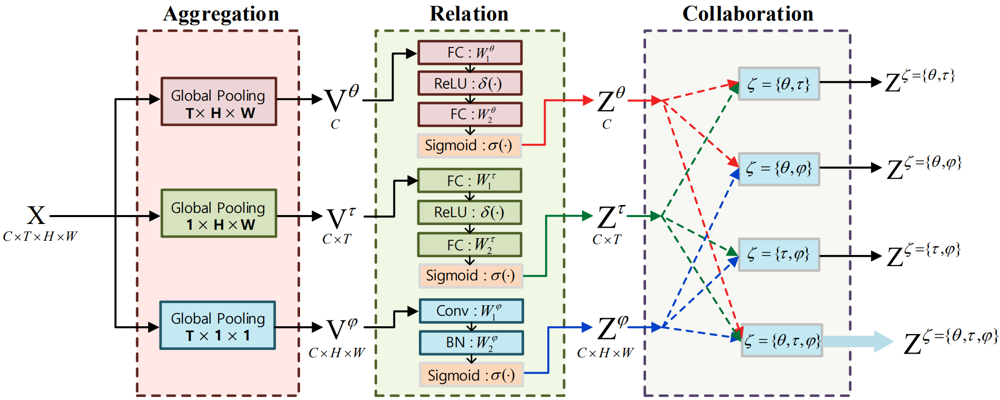

# CoTeRe-Net: Discovering Collaborative Ternary Relations in Videos

We release the code of our paper [CoTeRe-Net](http://www.ecva.net/papers/eccv_2020/papers_ECCV/papers/123510375.pdf). (ECCV 2020 Spotlight)

```
@inproceedings{shi2020cotere,
  title={CoTeRe-Net: Discovering Collaborative Ternary Relations in Videos},
  author={Shi, Zhensheng and Guan, Cheng and Cao, Liangjie and Li, Qianqian and Liang, Ju and Gu, Zhaorui and Zheng, Haiyong and Zheng, Bing},
  booktitle={European Conference on Computer Vision},
  pages={379--396},
  year={2020},
  organization={Springer}
}
```

## Introduction

[CoTeRe-Net](http://www.ecva.net/papers/eccv_2020/papers_ECCV/papers/123510375.pdf) is a novel relation model that discovers relations of both implicit and explicit cues as well as their collaboration in videos. It concerns ***Co***llaborative ***Te***rnary ***Re***lations (**CoTeRe**), where the ternary relation involves channel (**C**, for implicit), temporal (**T**, for implicit), and spatial (**S**, for explicit) relation (**R**).

<div align="center">
  
</div>

This code is based on the [PySlowFast](https://github.com/facebookresearch/SlowFast) codebase. The core implementation for CoTeRe-Net are [lib/models/cotere_builder.py](lib/models/cotere_builder.py), [lib/models/ctsr_helper.py](lib/models/ctsr_helper.py). We devise a flexible and effective CTSR module to collaborate ternary relations for 3D-CNNs, and then construct CoTeRe-Nets for action recognition.

## Requirements

- Python >= 3.6
- Numpy
- PyTorch 1.3
- [fvcore](https://github.com/facebookresearch/fvcore/): `pip install 'git+https://github.com/facebookresearch/fvcore'`
- [torchvision](https://github.com/pytorch/vision/) that matches the PyTorch installation.
  You can install them together at [pytorch.org](https://pytorch.org) to make sure of this.
- simplejson: `pip install simplejson`
- GCC >= 4.9
- PyAV: `conda install av -c conda-forge`
- ffmpeg (4.0 is prefereed, will be installed along with PyAV)
- PyYaml: (will be installed along with fvcore)
- tqdm: (will be installed along with fvcore)
- iopath: `pip install -U iopath` or `conda install -c iopath iopath`
- psutil: `pip install psutil`
- OpenCV: `pip install opencv-python`
- torchvision: `pip install torchvision` or `conda install torchvision -c pytorch`

## Datasets

#### Something-Something V1
- Download the dataset and annotations from [dataset provider](https://20bn.com/datasets/something-something). 
- Download the *frame list* from the following links: ([train](https://drive.google.com/file/d/1GG9l8pNk1zBHqAlCGiNWbCqbcCdqwuQt/view?usp=sharing), [val](https://drive.google.com/file/d/1cNNnagoWqzo3GP30gOz0kFS49NqaO8Kh/view?usp=sharing)).
- Add prefix "folder_0" and rename all frame files, for example: 1/00001.jpg => 1/**1_0**00001.jpg, 999/00001.jpg => 999/**999_0**00001.jpg
- Put all annotation json files and the frame lists in the same folder, and set `DATA.PATH_TO_DATA_DIR` to the path. Set `DATA.PATH_PREFIX` to be the path to the folder containing extracted frames.

## Running

- To train and test a CoTeRe-ResNet-18 model from scratch on Something-Something V1. You can build variant CoTeRe-Nets via setting COTERE.TYPE.

  ```
  python tools/run_net.py \
    --cfg configs/SSv1/R3D_18_COTERE_32x1.yaml \
    DATA.PATH_TO_DATA_DIR path_to_frame_list \
    DATA.PATH_PREFIX path_to_frames \
    COTERE.TYPE CTSR
  ```
  You can also set the variables (DATA_PATH, FRAME_PATH, COTERE_TYPE) in [scripts/run_ssv1_r3d_18_32x1.sh](scripts/run_ssv1_r3d_18_32x1.sh), and then run the script.

  ```
  bash scripts/run_ssv1_r3d_18_32x1.sh
  ```

## Models
We will provide the models and results later.

## Acknowledgement
We really appreciate the contributors of following codebases.

- [facebookresearch/SlowFast](https://github.com/facebookresearch/SlowFast)
- [facebookresearch/VMZ](https://github.com/facebookresearch/VMZ)
- [kenshohara/3D-ResNets-PyTorch](https://github.com/kenshohara/3D-ResNets-PyTorch)
